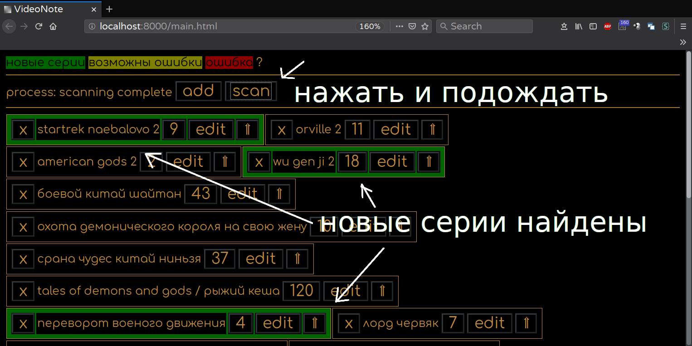

20181228 not working , even basic technique. FA-king black magic...  
20190212 alive and can be exported to executable uses  
`python3 -m eel videonote.py web --onefile --noconsole`  
20190325 latest release date  

  

# VideoNote  
VideoNote - записная книжка с функцией поиска новых серий(эпизодов) аниме, дорам, сериалов.  
Подерживаемые сайты на момент релиза:  
- `animevost.org`
- `play.shikimori.org`
- `anistar.me`
- `vk.com` (только открытые альбомы и только считает число видеозаписей)
- `green-teatv.com`
- `anilibria.tv`
- `lostfilm.tv`  
- `youtube`  (ищет максимальную цифру в лейлисте(VIEW FULL PLAYLIST link), могут быть ошибки)
Примеры ссылок расположены ниже (example).  
  
VideoNote is notebook with scan functionality, for few video services, which target is storing data about viewed episodes of anime doramas series etc, and scan sources that detect new episodes. This is `HTML` version of `DASprogress 132` python3 app, based on `eel python` library.  
## Open Source Software.  

# This version can scan sites uses links:  
- `animevost.org` - example: `http://animevost.org/tip/tv/2167-tensei-shitara-slime-datta-ken.html`
- `play.shikimori.org`  - example: `https://play.shikimori.org/animes/35790-tate-no-yuusha-no-nariagari` - example: `https://play.shikimori.org/animes/35790-tate-no-yuusha-no-nariagari/video_online/1`  
- `anistar.me` - example: `https://anistar.me/6695-o-moem-pererozhdenii-v-sliz-tensei-shitara-slime-datta-ken.html`
- `vk.com` - example: `https://vk.com/videos-24440848?section=album_54694282` (only opened albums/number videos inside)
- `green-teatv.com` - example: `http://green-teatv.com/5865-uborka-so-strastyu-clean-with-passion-for-now.html`
- `anilibria.tv` - example: `https://www.anilibria.tv/release/ueno-san-wa-bukiyou.html`
- `lostfilm.tv` - example: `https://www.lostfilm.tv/series/Future_Man/season_2/`  
- `youtube` - example: `https://www.youtube.com/playlist?list=PLyVKH-FrvxMBjQbkI9NXCZcrQrxs22joy`  