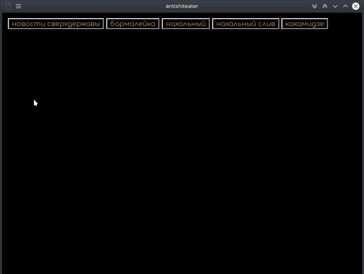
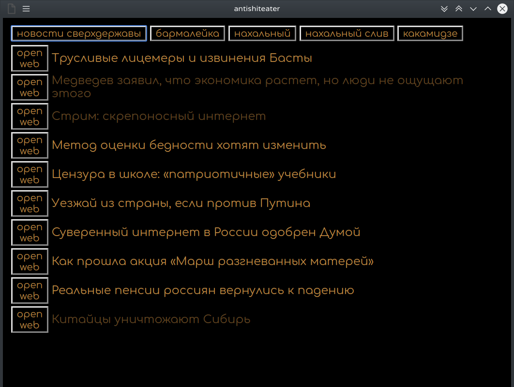

worked at 20190219  
# this is eel python programm, which need chrome/chromium installed  
  
  
Can be executed from source `ase.py`.  
`dist` folder include executable for kubuntu 18.04 .  
That create executable for your as you need:
 - installed `python3`
 - installed `pip3`(linux) or `pip`(on windows)
 - installed `pyinstaller`
 - installed eel python lib ... `pip3 install eel`
 - clone this folder with subfolders, uses downGit https://minhaskamal.github.io/DownGit/#/home  
 - from `ase.py` level(open terminal/console inside folder) execute command `python3 -m eel ase.py web --onefile --noconsole`  , Enter ... wait ... done  
 - get executable inside dist folder
 
 20200511  
 ... for `aset.py` terminal version the command is `python3 -m PyInstaller aset.py --onefile --console`